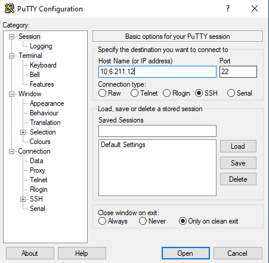
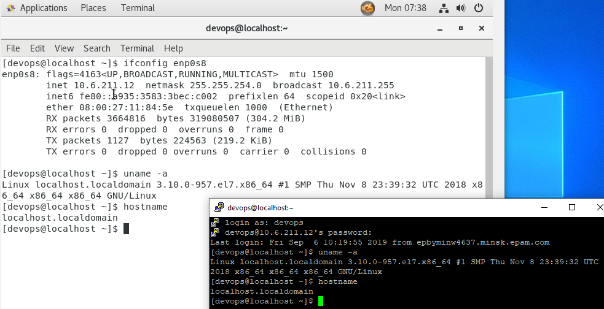
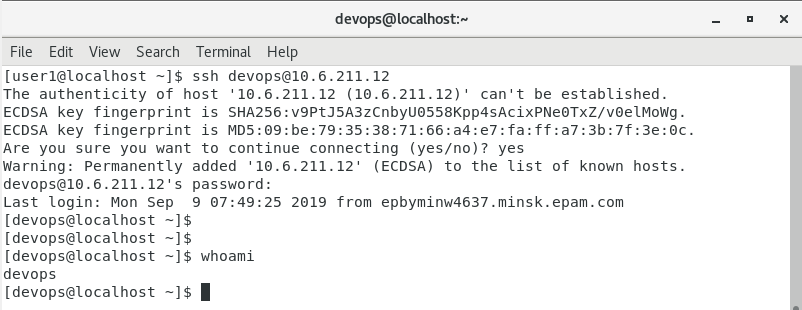
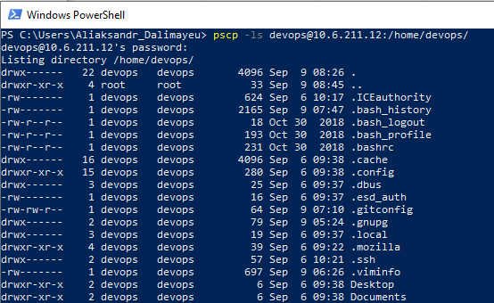
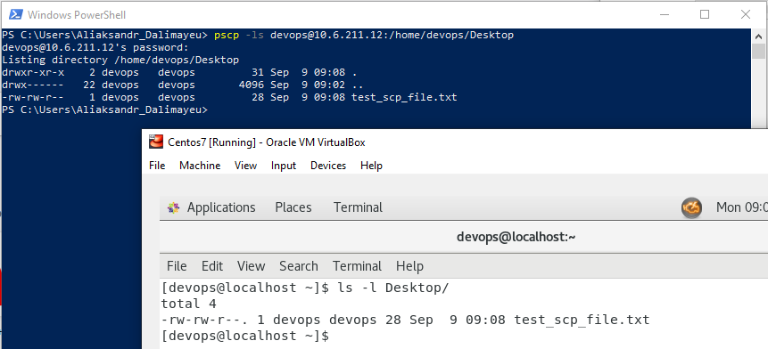
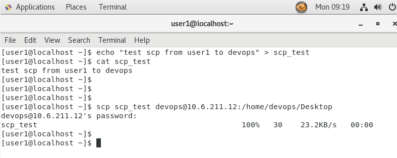
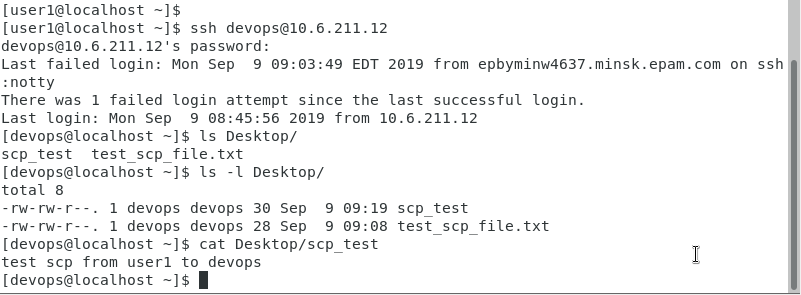

## Prerequizites
1. Log in to VM as **devops** user and find out IP address of brigde interface (**enp0s8**)  

2. Make sure sshd service is enabled
  
## Tasks

### 1. SSH connection
  - For Windows as Host OS  
    - download and install SSH client (etc. [PuTTY](https://www.putty.org/))  
    - run PuTTY. In Configuration window enter early remembered IP-address (etc. 10.6.211.12) in "Host Name (or IP address)" field  
      

    - in appeared message select "yes" for approving ssh keys exchange  
      

    - enter as **devops** user  
      

    - now you are in VM os. try execute "hostname", "uname -a"  
      

  - For Linux as Host OS
    - run Terminal
    - establish ssh connection by executing: `ssh devops@10.6.211.12`  
      
  
  
### 2. Copying files by SSH
  - For Windows as Host OS  
    - download and install SCP client (etc. [PSCP](https://the.earth.li/~sgtatham/putty/latest/w64/pscp.exe))  
    - open PowerShell and execute `pscp -V` to check installation  
      
    - get files list in **devops** home directory: `pscp -ls devops@10.6.211.12:/home/devops`  
      
    - copy file to VM: `pscp .\test_scp_file.txt devops@10.6.211.12:/home/devops/Desktop`  
      
    - check the copying  
      

  - For Linux as Host OS
    - run Terminal
    - let's create test file and copy it to **devops** user on VM  
      
    - check the copying  
      

